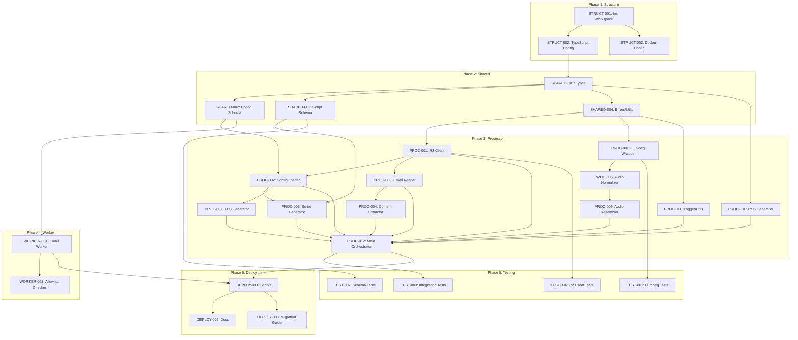

# Task Breakdown: Sectioned Episodes with Audio Normalization

**Spec ID:** sections-intros
**Version:** 1.0
**Date:** 2026-01-12
**Author:** Architect Agent

---

## Task Overview

| Phase | Tasks | Estimated Time |
|-------|-------|----------------|
| Phase 1: Project Structure | 3 tasks | 2-3 hours |
| Phase 2: Shared Code | 4 tasks | 2-3 hours |
| Phase 3: Core Processor | 12 tasks | 10-15 hours |
| Phase 4: Email Worker | 2 tasks | 1-2 hours |
| Phase 5: Integration & Testing | 4 tasks | 4-6 hours |
| Phase 6: Deployment | 3 tasks | 2-3 hours |
| **Total** | **28 tasks** | **21-32 hours** |

---

## Phase 1: Project Structure

### Task: STRUCT-001
- **Title**: Initialize monorepo workspace structure
- **Description**: Create the new directory structure for the monorepo with workers/, processor/, and shared/ directories. Set up root package.json with npm workspaces configuration. Create placeholder package.json files for each package.
- **Priority**: 1 (Critical)
- **Dependencies**: []
- **Estimated Complexity**: Low
- **Agent**: coder
- **Parallelizable**: No
- **Files to Create**:
  - `package.json` (root, workspaces config)
  - `workers/email-worker/package.json`
  - `processor/package.json`
  - `shared/package.json`
  - `tsconfig.base.json` (shared TypeScript config)

### Task: STRUCT-002
- **Title**: Configure TypeScript for all packages
- **Description**: Create tsconfig.json for each package with proper references to shared. Configure path aliases for cross-package imports. Ensure strict mode is enabled.
- **Priority**: 1 (Critical)
- **Dependencies**: [STRUCT-001]
- **Estimated Complexity**: Low
- **Agent**: coder
- **Parallelizable**: No
- **Files to Create**:
  - `workers/email-worker/tsconfig.json`
  - `processor/tsconfig.json`
  - `shared/tsconfig.json`

### Task: STRUCT-003
- **Title**: Set up Docker configuration for processor
- **Description**: Create Dockerfile with Node.js 20 Alpine base, FFmpeg installation, and proper entry point. Create docker-compose.yml for local development. Create .env.example with all required environment variables.
- **Priority**: 2 (Important)
- **Dependencies**: [STRUCT-001]
- **Estimated Complexity**: Low
- **Agent**: coder
- **Parallelizable**: Yes (with STRUCT-002)
- **Files to Create**:
  - `processor/Dockerfile`
  - `processor/docker-compose.yml`
  - `processor/.env.example`

---

## Phase 2: Shared Code

### Task: SHARED-001
- **Title**: Create shared type definitions
- **Description**: Define all shared TypeScript interfaces including StructuredScript, ScriptSection, NewsletterContent, Episode, EpisodeMetadata, and ProcessorEnv. These types will be used by both the processor and for validation.
- **Priority**: 1 (Critical)
- **Dependencies**: [STRUCT-002]
- **Estimated Complexity**: Low
- **Agent**: coder
- **Parallelizable**: No
- **Files to Create**:
  - `shared/types/index.ts`

### Task: SHARED-002
- **Title**: Create extended config schema with audio settings
- **Description**: Update the Zod config schema to include audio normalization settings and music paths. Remove min_words, max_words, target_duration_minutes from script_generation. Ensure backwards compatibility by making new fields optional with defaults.
- **Priority**: 1 (Critical)
- **Dependencies**: [SHARED-001]
- **Estimated Complexity**: Medium
- **Agent**: coder
- **Parallelizable**: No
- **Files to Create**:
  - `shared/schemas/config.ts`

### Task: SHARED-003
- **Title**: Create structured script schema
- **Description**: Define Zod schema for structured script output including validation rules: must have intro first, synthesis last, at least one topic. Export types inferred from schema.
- **Priority**: 1 (Critical)
- **Dependencies**: [SHARED-001]
- **Estimated Complexity**: Medium
- **Agent**: coder
- **Parallelizable**: Yes (with SHARED-002)
- **Files to Create**:
  - `shared/schemas/script.ts`

### Task: SHARED-004
- **Title**: Extract and share error classes and utilities
- **Description**: Copy error classes from src/lib/errors.ts to shared/utils/errors.ts. Copy retry logic from src/lib/retry.ts to shared/utils/retry.ts. Update imports and exports.
- **Priority**: 2 (Important)
- **Dependencies**: [SHARED-001]
- **Estimated Complexity**: Low
- **Agent**: coder
- **Parallelizable**: Yes (with SHARED-002, SHARED-003)
- **Files to Create**:
  - `shared/utils/errors.ts`
  - `shared/utils/retry.ts`
  - `shared/index.ts` (main export)

---

## Phase 3: Core Processor

### Task: PROC-001
- **Title**: Implement R2 S3 client
- **Description**: Create S3 client wrapper using AWS SDK v3 configured for R2. Implement functions for listing, getting, putting, and deleting objects. Include proper error handling and logging.
- **Priority**: 1 (Critical)
- **Dependencies**: [SHARED-004]
- **Estimated Complexity**: Medium
- **Agent**: coder
- **Parallelizable**: No
- **Files to Create**:
  - `processor/src/storage/r2-client.ts`

### Task: PROC-002
- **Title**: Implement S3-based config loader
- **Description**: Create config loader that fetches config.yaml from R2 via S3 API. Parse YAML and validate against extended schema. Cache config for the processing run.
- **Priority**: 1 (Critical)
- **Dependencies**: [PROC-001, SHARED-002]
- **Estimated Complexity**: Low
- **Agent**: coder
- **Parallelizable**: No
- **Files to Create**:
  - `processor/src/config/loader.ts`

### Task: PROC-003
- **Title**: Implement email reader and parser
- **Description**: Implement functions to list pending emails from R2 and read .eml files. Use postal-mime to parse raw email into structured format. Extract sender, subject, date, and body.
- **Priority**: 1 (Critical)
- **Dependencies**: [PROC-001]
- **Estimated Complexity**: Low
- **Agent**: coder
- **Parallelizable**: Yes (with PROC-002)
- **Files to Create**:
  - `processor/src/email/reader.ts`
  - `processor/src/email/parser.ts`

### Task: PROC-004
- **Title**: Implement content extractor
- **Description**: Copy and adapt content extraction logic from src/lib/content-extractor.ts. Clean HTML, extract links, apply keyword filters. Return NewsletterContent structure.
- **Priority**: 2 (Important)
- **Dependencies**: [PROC-003]
- **Estimated Complexity**: Low
- **Agent**: coder
- **Parallelizable**: No
- **Files to Create**:
  - `processor/src/content/extractor.ts`
  - `processor/src/content/filter.ts`

### Task: PROC-005
- **Title**: Implement structured script generator
- **Description**: Create Claude API integration that outputs structured JSON. Update prompts to request intro/topic/synthesis format. Validate response against StructuredScriptSchema. Include retry logic for malformed responses.
- **Priority**: 1 (Critical)
- **Dependencies**: [PROC-002, SHARED-003]
- **Estimated Complexity**: High
- **Agent**: coder
- **Parallelizable**: No
- **Files to Create**:
  - `processor/src/script/generator.ts`
  - `processor/src/script/prompts.ts`
  - `processor/src/script/validator.ts`

### Task: PROC-006
- **Title**: Implement FFmpeg wrapper
- **Description**: Create FFmpeg command wrapper using child_process spawn. Implement functions for: measuring loudness, normalizing audio, concatenating files, getting duration. Parse stderr for loudnorm measurements.
- **Priority**: 1 (Critical)
- **Dependencies**: [SHARED-004]
- **Estimated Complexity**: High
- **Agent**: coder
- **Parallelizable**: Yes (with PROC-005)
- **Files to Create**:
  - `processor/src/audio/ffmpeg.ts`

### Task: PROC-007
- **Title**: Implement section-based TTS generator
- **Description**: Create OpenAI TTS integration that generates audio per section. Handle chunking for sections exceeding 2000 tokens. Save audio to temp files. Use style_prompt from config.
- **Priority**: 1 (Critical)
- **Dependencies**: [PROC-002]
- **Estimated Complexity**: Medium
- **Agent**: coder
- **Parallelizable**: Yes (with PROC-006)
- **Files to Create**:
  - `processor/src/audio/tts.ts`

### Task: PROC-008
- **Title**: Implement audio normalizer
- **Description**: Create multi-level normalization pipeline. Normalize per-chunk, per-section, and episode-wide. Use two-pass loudnorm for accuracy. Target -16 LUFS for speech.
- **Priority**: 1 (Critical)
- **Dependencies**: [PROC-006]
- **Estimated Complexity**: Medium
- **Agent**: coder
- **Parallelizable**: No
- **Files to Create**:
  - `processor/src/audio/normalizer.ts`

### Task: PROC-009
- **Title**: Implement audio assembler with music
- **Description**: Create final episode assembly using FFmpeg filter_complex. Download music assets from R2. Add intro music with fade-in, transitions between sections, outro with fade-out. Normalize music to -20 LUFS.
- **Priority**: 1 (Critical)
- **Dependencies**: [PROC-008]
- **Estimated Complexity**: High
- **Agent**: coder
- **Parallelizable**: No
- **Files to Create**:
  - `processor/src/audio/assembler.ts`

### Task: PROC-010
- **Title**: Implement RSS generator
- **Description**: Adapt RSS generation from src/lib/rss-generator.ts. Generate episode descriptions from structured script. Include section information in show notes. Maintain iTunes compatibility.
- **Priority**: 2 (Important)
- **Dependencies**: [SHARED-001]
- **Estimated Complexity**: Low
- **Agent**: coder
- **Parallelizable**: Yes (with PROC-009)
- **Files to Create**:
  - `processor/src/rss/generator.ts`

### Task: PROC-011
- **Title**: Implement logger and utilities
- **Description**: Adapt logger from src/lib/logger.ts for Node.js environment. Create utility functions for temp file management, cleanup, and path handling.
- **Priority**: 2 (Important)
- **Dependencies**: [SHARED-004]
- **Estimated Complexity**: Low
- **Agent**: coder
- **Parallelizable**: Yes
- **Files to Create**:
  - `processor/src/utils/logger.ts`
  - `processor/src/utils/temp.ts`

### Task: PROC-012
- **Title**: Implement main orchestrator
- **Description**: Create main entry point that orchestrates the full pipeline: read emails, extract content, generate script, generate audio per section, normalize, assemble, upload, update RSS, cleanup. Handle errors gracefully with proper logging.
- **Priority**: 1 (Critical)
- **Dependencies**: [PROC-001 through PROC-011]
- **Estimated Complexity**: High
- **Agent**: coder
- **Parallelizable**: No
- **Files to Create**:
  - `processor/src/index.ts`

---

## Phase 4: Email Worker Simplification

### Task: WORKER-001
- **Title**: Create simplified email worker
- **Description**: Create minimal email worker that: checks sender against allowlist (string matching only), stores raw .eml to R2 at pending-emails/{timestamp}-{id}.eml, optionally forwards email. Target < 10ms CPU time.
- **Priority**: 1 (Critical)
- **Dependencies**: [SHARED-002]
- **Estimated Complexity**: Low
- **Agent**: coder
- **Parallelizable**: Yes (with Phase 3)
- **Files to Create**:
  - `workers/email-worker/src/index.ts`
  - `workers/email-worker/wrangler.toml`

### Task: WORKER-002
- **Title**: Create allowlist checker utility
- **Description**: Implement fast sender validation supporting exact email match and domain wildcards (*@domain.com). Keep logic minimal for CPU constraints.
- **Priority**: 2 (Important)
- **Dependencies**: [WORKER-001]
- **Estimated Complexity**: Low
- **Agent**: coder
- **Parallelizable**: No
- **Files to Create**:
  - `workers/email-worker/src/allowlist.ts`

---

## Phase 5: Integration and Testing

### Task: TEST-001
- **Title**: Write unit tests for FFmpeg wrapper
- **Description**: Create unit tests that mock child_process spawn. Test command construction for normalization, concatenation, and assembly. Test error handling for FFmpeg failures.
- **Priority**: 2 (Important)
- **Dependencies**: [PROC-006]
- **Estimated Complexity**: Medium
- **Agent**: tester
- **Parallelizable**: Yes
- **Files to Create**:
  - `processor/src/audio/__tests__/ffmpeg.test.ts`

### Task: TEST-002
- **Title**: Write unit tests for script validation
- **Description**: Create unit tests for StructuredScriptSchema. Test valid inputs, invalid JSON, missing sections, wrong section order. Test edge cases.
- **Priority**: 2 (Important)
- **Dependencies**: [SHARED-003]
- **Estimated Complexity**: Low
- **Agent**: tester
- **Parallelizable**: Yes
- **Files to Create**:
  - `shared/schemas/__tests__/script.test.ts`

### Task: TEST-003
- **Title**: Write integration tests for processor
- **Description**: Create integration tests that mock Claude and OpenAI APIs but use real FFmpeg. Test full pipeline from email reading to RSS generation. Verify output files are valid.
- **Priority**: 2 (Important)
- **Dependencies**: [PROC-012]
- **Estimated Complexity**: High
- **Agent**: tester
- **Parallelizable**: No
- **Files to Create**:
  - `processor/src/__tests__/integration.test.ts`

### Task: TEST-004
- **Title**: Write unit tests for R2 client
- **Description**: Create unit tests that mock AWS SDK S3 client. Test all CRUD operations. Test error handling for network failures.
- **Priority**: 2 (Important)
- **Dependencies**: [PROC-001]
- **Estimated Complexity**: Medium
- **Agent**: tester
- **Parallelizable**: Yes
- **Files to Create**:
  - `processor/src/storage/__tests__/r2-client.test.ts`

---

## Phase 6: Deployment

### Task: DEPLOY-001
- **Title**: Create deployment scripts
- **Description**: Create shell scripts for building and deploying. Include: build-processor.sh (TypeScript compile, Docker build), deploy-worker.sh (wrangler deploy), run-processor.sh (Docker run wrapper for cron).
- **Priority**: 2 (Important)
- **Dependencies**: [PROC-012, WORKER-001]
- **Estimated Complexity**: Low
- **Agent**: coder
- **Parallelizable**: No
- **Files to Create**:
  - `scripts/build-processor.sh`
  - `scripts/deploy-worker.sh`
  - `scripts/run-processor.sh`

### Task: DEPLOY-002
- **Title**: Create documentation
- **Description**: Write deployment documentation including: R2 bucket setup, API token generation, environment variable configuration, cron setup on host, troubleshooting guide.
- **Priority**: 3 (Nice-to-have)
- **Dependencies**: [DEPLOY-001]
- **Estimated Complexity**: Medium
- **Agent**: coder
- **Parallelizable**: No
- **Files to Create**:
  - `docs/deployment.md`
  - `docs/configuration.md`

### Task: DEPLOY-003
- **Title**: Create migration guide
- **Description**: Write step-by-step migration guide from old architecture to new. Include: parallel operation phase, validation steps, rollback procedures, cleanup of old code.
- **Priority**: 2 (Important)
- **Dependencies**: [DEPLOY-001]
- **Estimated Complexity**: Low
- **Agent**: coder
- **Parallelizable**: Yes (with DEPLOY-002)
- **Files to Create**:
  - `docs/migration.md`

---

## Dependency Graph



---

## Parallelization Opportunities

### Can run in parallel:
- STRUCT-002 and STRUCT-003 (after STRUCT-001)
- SHARED-002, SHARED-003, SHARED-004 (after SHARED-001)
- PROC-003 and PROC-002 (after PROC-001)
- PROC-005 and PROC-006 (independent FFmpeg vs Claude logic)
- PROC-006 and PROC-007 (independent audio components)
- PROC-010 and PROC-009 (RSS and audio assembly)
- WORKER-001 with all Phase 3 tasks (after SHARED-002)
- All TEST tasks (after their dependencies)
- DEPLOY-002 and DEPLOY-003 (after DEPLOY-001)

### Must be sequential:
- STRUCT-001 first (all others depend on it)
- SHARED-001 before other SHARED tasks
- PROC-001 before PROC-002, PROC-003
- PROC-006 -> PROC-008 -> PROC-009 (audio pipeline)
- PROC-005 before PROC-012 (script before orchestrator)
- All PROC tasks before PROC-012 (main orchestrator)
- TEST-003 last (integration tests need full system)

---

## Critical Path

The critical path through the implementation:

```
STRUCT-001 (0.5h)
    ↓
STRUCT-002 (0.5h)
    ↓
SHARED-001 (0.5h)
    ↓
SHARED-002 + SHARED-003 (1h parallel)
    ↓
SHARED-004 (0.5h)
    ↓
PROC-001 (2h)
    ↓
PROC-002 (1h)
    ↓
PROC-005 (3h) ←── Most complex: Claude JSON output
    ↓
PROC-006 (3h) ←── Most complex: FFmpeg wrapper
    ↓
PROC-008 (2h)
    ↓
PROC-009 (3h) ←── Most complex: Audio assembly
    ↓
PROC-012 (2h)
    ↓
TEST-003 (3h)
    ↓
DEPLOY-001 (1h)

Total critical path: ~19 hours
```

With parallelization, total elapsed time can be reduced to ~12-15 hours.
